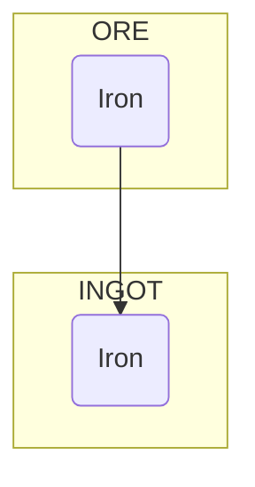

- [Resources](#resources)
- [Ships](#ships)

# Resources
- Ore: Minable from stars

# Ships
- Explorer
  - Analyze starts
  - Can find artifacts (celestus style)
  - Can transport one artifact
- Builder
  - Build station
  - Can carry a bit of resources
- Freighter
  - Can carry resources
